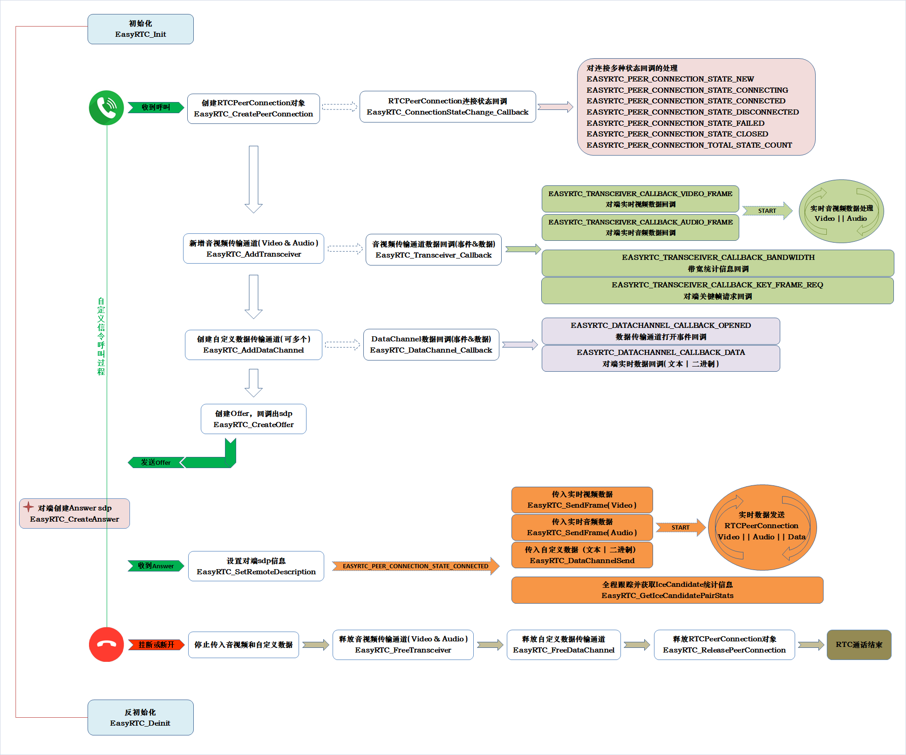

# EasyRTC
EasyRTC是一套完整的WebRTC开发套件，包括设备端、服务端、客户端，利用EasyRTC可以构建一套完美的视频交互类应用，例如智能摄像头、可视猫眼门铃、可穿戴硬件、无人机、无人车、机器人等各种场景。百闻不如一见，直接访问官网看效果：[https://www.easyrtc.cn](https://www.easyrtc.cn)

## WebP2P视频物联技术
EasyRTC新一代WebP2P视频物联技术，是一种基于ICE技术实现的点对点(P2P)通信平台，平台利用WebP2P、RTC、实时指令等技术，支持实时音视频通信、数据传输等功能，适用于多种物联网应用场景。

### 设备端
- 智能穿戴：AR眼镜、VR头显
- 智能家居：智能监控、智能音箱、智慧屏、智能门锁、健身镜、家庭机器人；
- 远程操控：无人机、无人车、行车记录仪；

### 客户端
- Android
- iOS
- Windows
- Mac
- H5
- 小程序

### 应用场景
- 实时监控
- 视频通话
- 紧急呼叫
- 远程控制
- 远程巡检
- 远程协作

## 目录说明

	./
	./android		//Android平台调用示例代码
	./windows		//Windows平台调用示例代码
	./linux			//Linux平台调用示例代码
	./include		//EasyRTC.h头文件
	./lib			//各种平台EasyRTC版本：Windows、Linux、Android、ARM
	./lib/android	//Android各平台库文件
	./lib/windows	//Windows x86 & x64平台库文件
	./lib/linux		//Linux x86 & x64平台库文件
	./lib/arm		//ARM嵌入式各种平台库文件
	./signalserver	//信令服务示例源码
	

## 开发示例

为了方便用户快速将EasyRTC接入到自己的硬件产品中，我们分别提供了Web、Windows、Android等多端示例，各种终端可相互通话通信：

- Windows版采集本地Camera和Mic的视音频，接入到EasyRTC信令系统与客户端进行双向通话；

- Android版采集手机前后端摄像头画面以及麦克风音频，实现移动终端与其他类型终端的互信互通；

## EasyRTC官网及更多流媒体音视频技术资源

EasyRTC效果演示：[www.easyrtc.cn](https://www.easyrtc.cn)

更多技术交流与合作：<a href="https://www.easydarwin.org" target="_blank" title="EasyDarwin开源社区">www.EasyDarwin.org</a>
